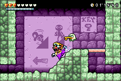
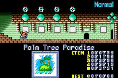

# Wario Land 4: Time Attack Edition (Rom Hack)
This is a rom hack of Wario Land 4 for individual levels speedrun.  
  

## How to play
Patch "WL4_TimeAttackEdition_v1.5.bps" to a vanilla Wario Land 4(US) rom.  
  
## Features  
- Timer is always on top-right of screen in level (replaced coin display,counts up to 99 minutes, 59 seconds, 59 frames)  
\* Toggle display between Minutes'Seconds'Frames and Minutes'Seconds''MilliSeconds (press START in the passage screen)  
\* Timer DOES include lag frames (v1.5 update)  
\* Insta-death when run out of the frog timer due to coin display replacement  
  
- Best time will be saved when escape with all four jewel pieces and Keyzer for each level/difficulty  
- Taking the lap time for each jewel piece and Keyzer and will be saved when escape with best time  
- Timer blinks when beating the best time  
\* To clear all best times, hold L+R when booting the game  
  
- Retry current level from pause menu  
- Change difficulty (press SELECT in the passage screen)  
- Faster movement in the map screen  
- Shorter cutscenes  
  
## Patch Download
https://github.com/becored/WL4_TA/releases/tag/v1.5  
Download "Wario_Land_4_TimeAttack_Edition_ver1.5.zip" from Assets.
  
## Credits
Special thanks to:  
- mpu for patches (ASM)  
- WL4Editor developers for awesome tool  
